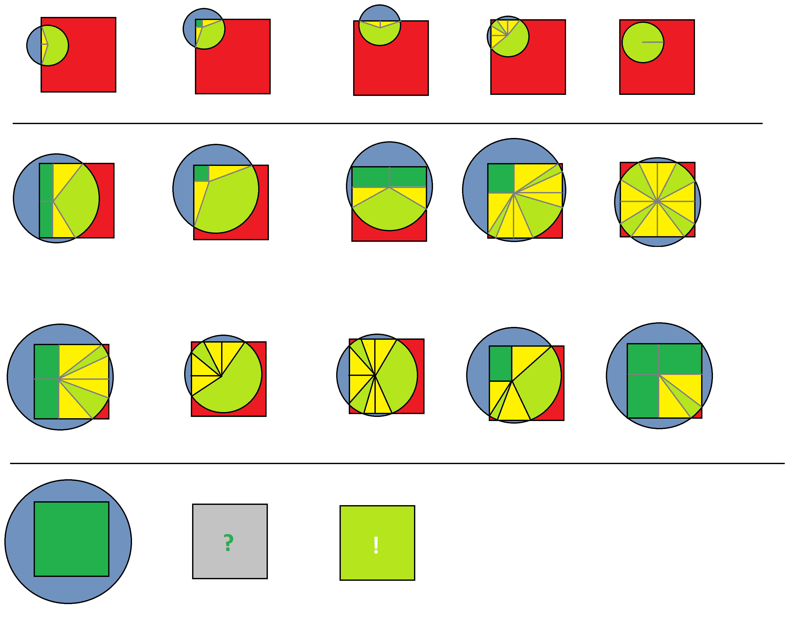

# Бекенд

<h2> CodeRun </h2>

>Уровень: **сложная**

169. Квадрат и окружность

___

Задача
--------

У Васи есть квадрат, вершины которого расположены в точках с координатами (0,0),(1,0),(0,1),(1,1). 
В этом квадрате расположены N фишек, i-я фишка имеет координаты (xi,yi). 
Фишки имеют пренебрежительно малые размеры, будем считать их материальными точками.

Вася играет в игру. Он выбирает случайную точку с равномерным распределением в своем квадрате. Потом Вася подсчитывает количество фишек, расстояние от которых до выбранной точки не превышает
R, и получает соответствующее количество очков.

Помогите Васе узнать математическое ожидание количества очков, которые он наберёт в описанной выше игре.

### Формат ввода
В первой строке входных данных содержатся два числа N и R (1≤N≤1000,0.001≤R≤2). 
Каждая из следующих N строк содержит разделенные пробелом координаты очередной фишки xi и yi(0.001≤xi,yi≤0.999).

Все числа во входных данных содержат не более 3 знаков после десятичной точки.

### Формат вывода
Выведите единственное число — матожидание количества очков.

Ответ будет считаться верным, если его относительная или абсолютная погрешность не превосходит 10^(−9).

### Ограничения

<table border="3">
<tr>
<td>

Ограничение времени

</td><td>

1 с

</td></tr>
<td>

Ограничение памяти

</td><td>

512 МБ

</td></tr>
</table>

Пример 1
<table border="3">
<tr>
<td>

Ввод

</td><td>

1 0.5

0.5 0.5

</td></tr>
<td>

Вывод

</td><td>

0.7853981634

</td></tr>
</table>

Пример 2
<table border="3">
<tr>
<td>

Ввод

</td><td>

2 2

0.001 0.001

0.999 0.999

</td></tr>
<td>

Вывод

</td><td>

2.0000000000

</td></tr>
</table>

>Объясняем проще (-_-;)・・・
>
>Как видим пример №2, выше (2, 2), первое число говорит сколько будет координат, 
> в данном примере 2 координаты Х и У, (0.001 0.001) и (0.999 0.999).
>
>А второе число, это это радиус
>
>Необходимо найти площадь (зеленого цвета): 
> 

___
Решение:
--------

Для решения мы расмотрим все варианты, возможного закрашивания квадрата (где маленький радиус, средний и большой):

А так же используем формулы Пифагора, для треугольников и нахождения площади внутри круга:

~~~Java
        // получаем площадь
        double place = 0;
        for (Double[] doubles: koordinateXY){
            if (R <= minRadius){
                place += CircleSmal(doubles, R, square);
            }else if(R < maxRadius){
                place += CircleMedium();
            }else {
                place += CircleBig();
            }
        }
~~~

А дальше расчитываем в зависимости от размера круга

~~~Java
    // --------------------------- расчёт кругов --------------------------

    // ------------- расчёты мальних кругов

    public static double CircleSmal(Double[] koordinateXY, double R, double square){
        double x = koordinateXY[0];
        double y = koordinateXY[1];
        x = Polarity(x, square);
        y = Polarity(y, square);

        double place = 0.0;

        if (x<R){
            if(y<R){
                double placeX = PlaceTriangle(x, R);
                double placeY = PlaceTriangle(y, R);
                double angelA = AngelTriangle(x, R);
                double angelB = AngelTriangle(y, R);

                // доходит до угла или нет?
                if(x<(R/2)){
                    //2
                    double placeSquare = PlaceSquare(x, y);
                    double angelSector = 360 - angelA - angelB - 90;
                    double placeSector = PlaceSector(angelSector, R);
                    place += placeSector + placeX + placeY + placeSquare;
                }else {
                    //4
                    double angelSector = 360 - (angelA * 2) - (angelB * 2);
                    double placeSector = PlaceSector(angelSector, R);
                    place += placeSector + (placeX * 2) + (placeY * 2);
                }
            }else {
                //1 боковая грань
                double placeX = PlaceTriangle(x, R);
                double angelA = AngelTriangle(x, R);
                double angelSector = 360 - (angelA * 2);
                double placeSector = PlaceSector(angelSector, R);
                place += placeSector + (placeX * 2);
            }
        }else {
            if (y >= R){
                //5 полность в квадрате
                return R * R * Math.PI;
            }else {
                //3 боковая грань
                double placeY = PlaceTriangle(y, R);
                double angelA = AngelTriangle(y, R);
                double angelSector = 360 - (angelA * 2);
                double placeSector = PlaceSector(angelSector, R);
                place += placeSector + (placeY * 2);
            }
        }

        return place;
    }
~~~

Не проходит по времени вывода (￢_￢)

И возможно, я не прав по решению  (×﹏×)

Итог: 
--------

>- [ ] Есть готовое решение 
>- [X] Свой код написан 
